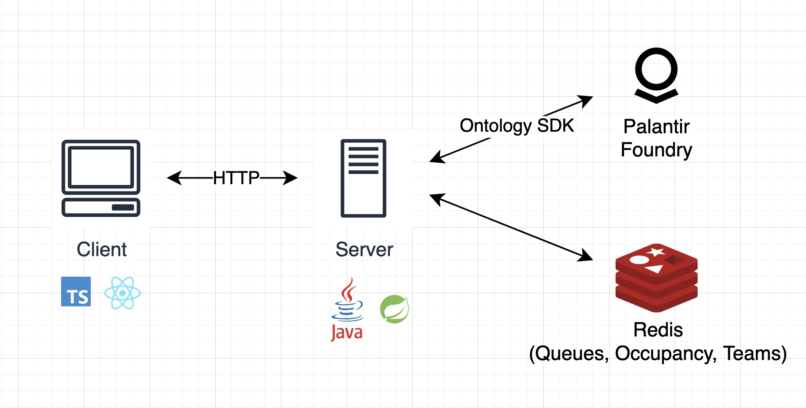
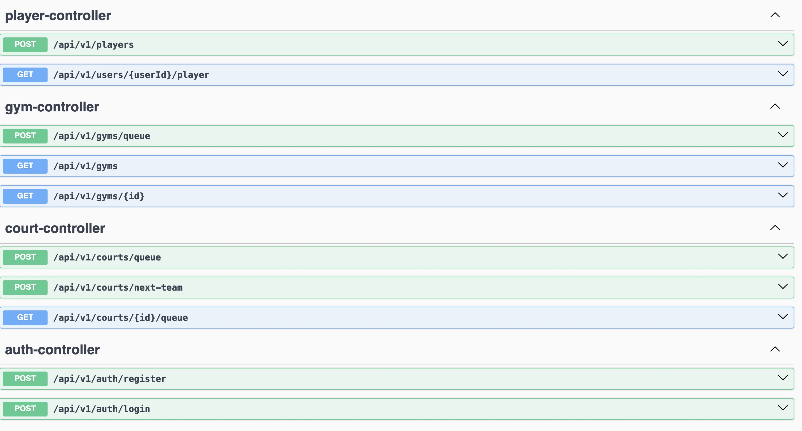

## Rec Foundry

### About
This is a Foundry for sports and recreational gyms. Often, finding balanced and 
organized pickup basketball games can be difficult. Team matchups can be uneven, 
and there's often no clear system of determining who's next on the court.

This system, built on the Palantir AIP and Foundry, maintains athlete profiles, gym occupancy, and virtual queues for more organized and fair games.
 
### Tech Stack
- Palantir Ontology SDK
- Java
- Spring Boot
- Redis
- TypeScript
- React

### Future Development
- [ ] API Security (e.g. JWT Auth, Cookies)
- [ ] Queue Matching Algorithms (e.g. position-based matching)
- [ ] Advanced Skill Metrics (e.g. stat tracking, highest level played)
- [ ] WebSockets for Real-Time Updates on Court Queues, Occupancy, Teams
- [ ] Test-Driven Development
- [ ] Extend to all Sports and Community Events

### Architecture

### API Endpoints

